# Capstone - Project Sunflower

This is a mood tracker app, with daily checkins and a profile page with more info about your moods. On your profile page some of the information you add in each of your checkins get incorporated into your personal flower. If you have several days in a row where you are in a good, happy mood your flower might slowly change to a brighter yellow or pink color. If you're having a few rough days in a row then your flower could slowly change colors to darker blues and purples. Each entry you add will also add to the height of the flower, and each entry will show up as a leaf on the side of the flower, making almost a timeline. Each flower will have a hover state with some brief info about that mood entry, and if you click on it, it will take you to the full entry. 

### Wireframes

##### Home

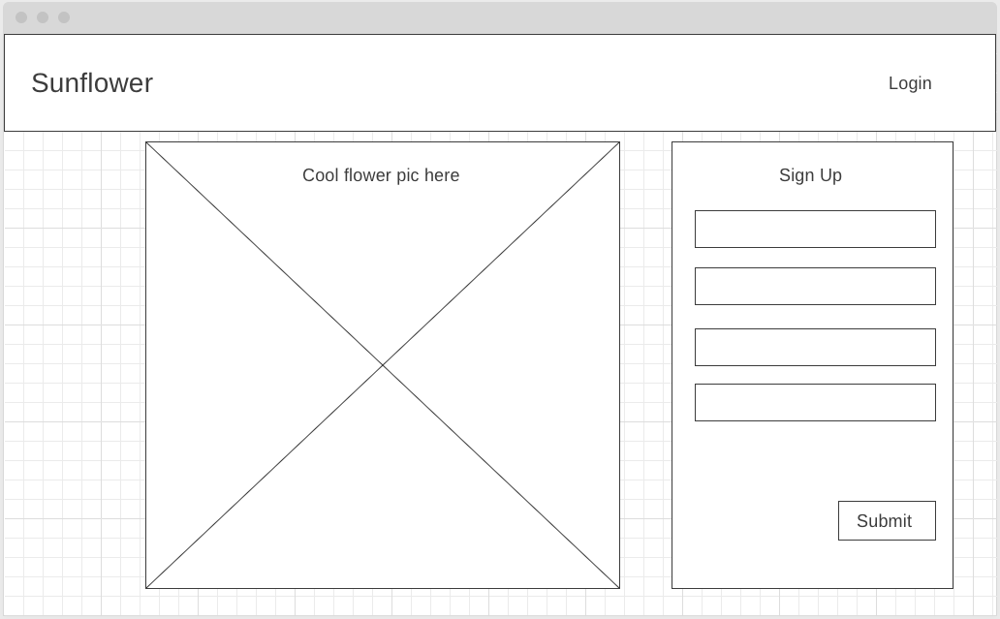

This page will just have an example of what your flower could look like, with a signup form already on the page, and a link to login if you already have an account. 

##### Profile

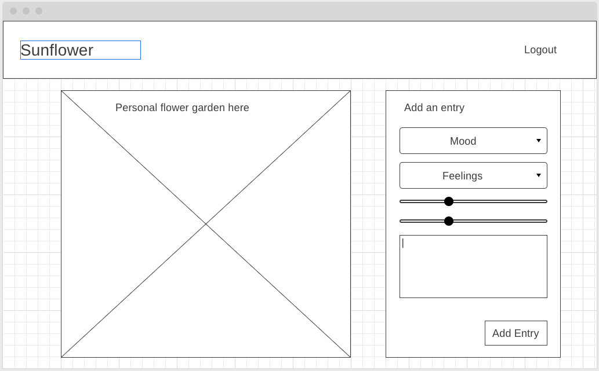

When you click in the flower garden box, it will take you to the 'timeline' page with a list of every entry shown as leaves on your flower. The hight of the flower will be based on the number of entries, and the various colors of the flower will vary depending on the average mood/emotions/feelings over the last few days. 

##### Timeline

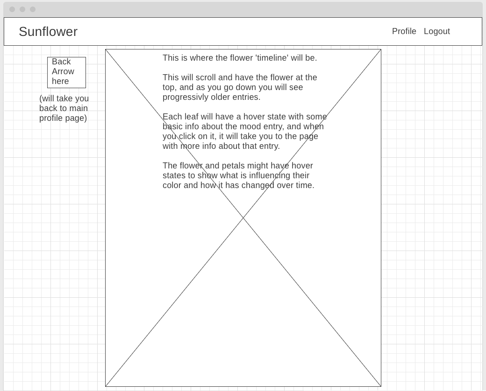

This timeline will continue to scroll as long as there are entries. Each entry will add 50px or so of height to the flower. There will be a back arrow on the left side of the screen to take you back to the profile page. Clicking on any leaf/entry will take you to the show page for that entry. 

##### Entry Show Page

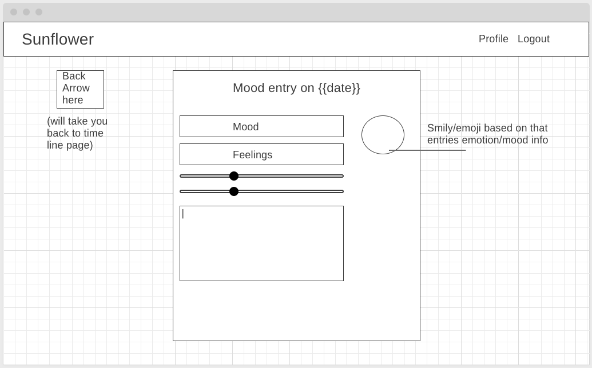

### DB Models and ERD

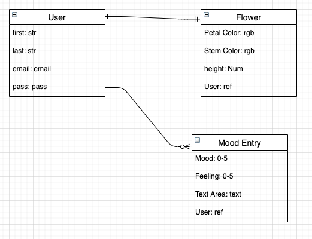

#### ERD V2

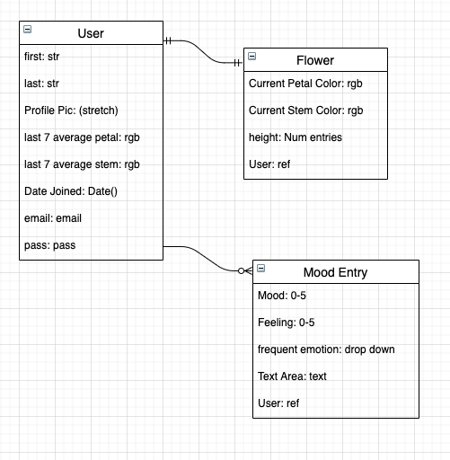

Three models, one for user with basic info and login. one-to-one between flower and user, and a one-to-many relation with mood entries. 

## Visual Inspiration

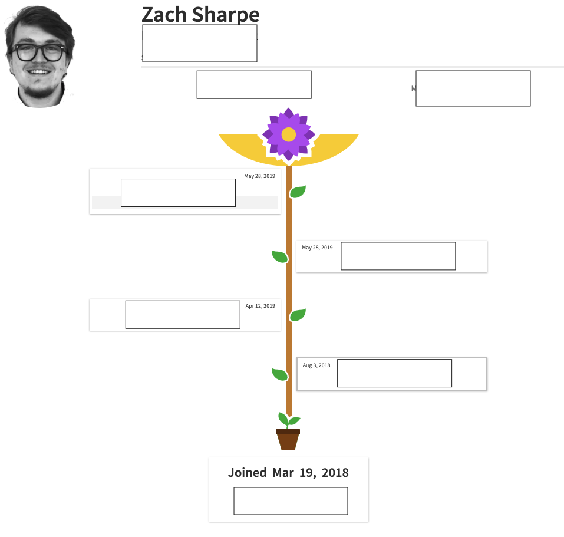

[The Grow Tool / Motis Grow](https://www.motispeople.com/motis-grow)

This is screenshot from an older version of a tool called 'The Grow Tool' made by the company I used to work for, Blink UX, which keeps track of professional growth. This screen shows salary info, changes to profit sharing and bonuses, which is why it's all cleared out ;) . This type of timeline is what I am hoping to acheive. 

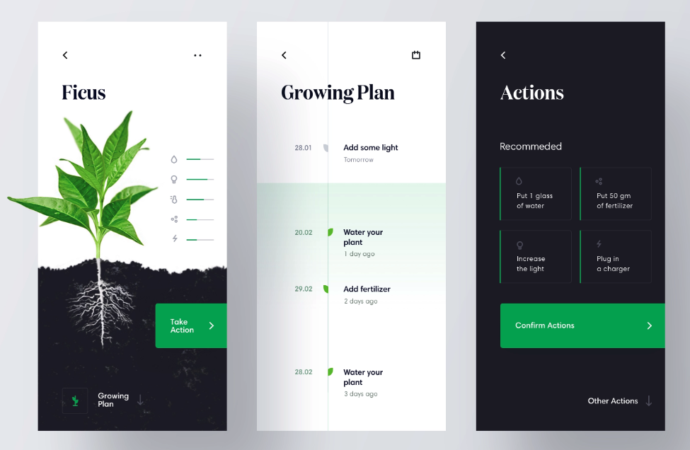

[From Den Klenkov on Dribbble](https://dribbble.com/shots/6522758-IoT-App-for-growing-plants)

I like the clean design and subtle use of color here. Also adding earth and roots at the bottom of the timeline. 

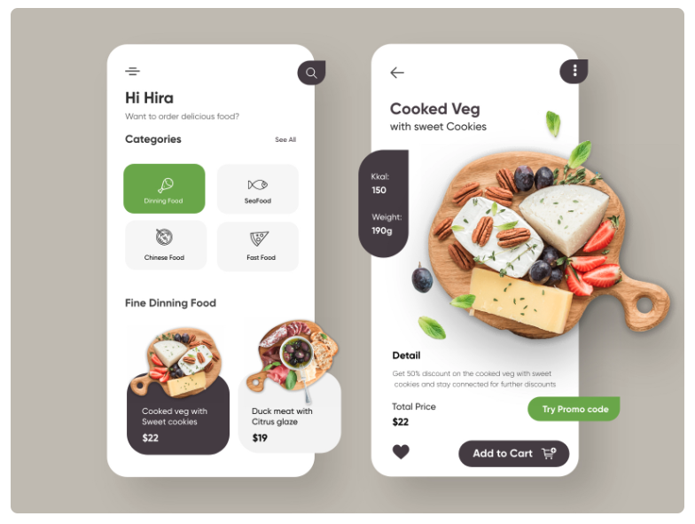

[From Hira Riaz on Dribbble](https://dribbble.com/shots/12992999-Restaurant-Mobile-Application-UX-UI-Design)

I included this as a reference to a modern playful layout with very minimal and intentional use of color. I like the rounded corners, and overall softness usere. 

#### Fonts

##### [Playfair Display](https://fonts.google.com/specimen/Playfair+Display?category=Serif,Display,Handwriting,Monospace&preview.text=Project+Sunflower&preview.text_type=custom)

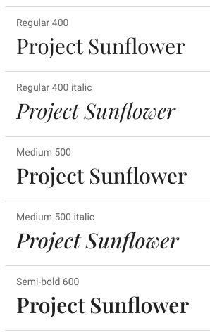

I like the medium 500 or even the semi-bold 600 Playfair display font for my titles and headers. I like the strong line weight and serifs, I think they will add to the clean modern design. 

##### [Lato](https://fonts.google.com/specimen/Lato?preview.text=Body+text+-+Project+Sunflower&preview.text_type=custom&query=lato#standard-styles)

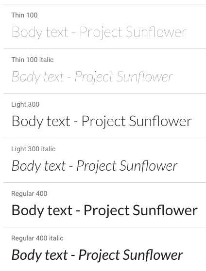

I'm thinking this is a good, softer, font for body text. 

## Tech Stack

- Node 

- Express 

- Postgresql 

### External Express Modules/Middleware

- [helmet](https://github.com/helmetjs/helmet)
- [protect](https://github.com/RisingStack/protect)
- [tippy](https://atomiks.github.io/tippyjs/)
- [morgan](https://github.com/expressjs/morgan) 
- [passport](http://www.passportjs.org/)
- [node-postgres](https://node-postgres.com/)

## MVP 

- user auth

- basic flower with changing colors 

- infinitely scrolling log of mood entries

- basic styling

## Sprint Schedule

##### Sprint 1

- get backend server working

- setup db models

- ability to create mood entries tied to users using insomnia 

##### Sprint 2

- User login, profile page after login 

- all pages made with basic wireframes and styles

- ensure all db models are relating properly

##### Sprint 3

- basic version of flower 'timeline'
  
  - process mood info and turn that into an rgb value
  
  - change color of basic flower based on mood info

##### Sprint 4

- Implement final styles 

##### Sprint 5

- Bug fix!

- Test!

- Deploy!

